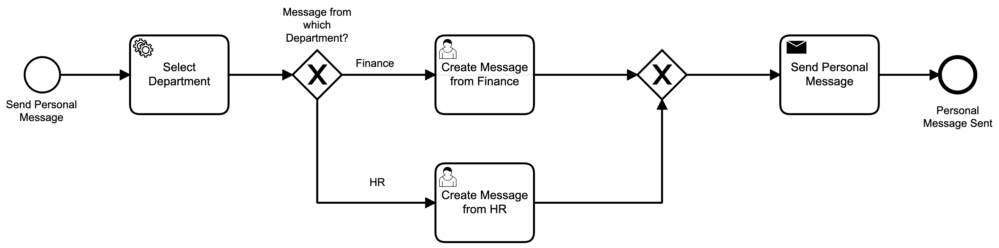
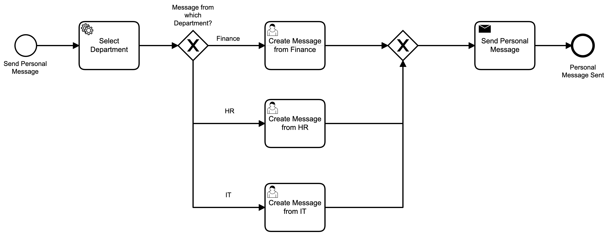

# Basic instance migration of a User Task and a Send Task

This examples walks you through the process of creating a migration plan for a User Task and a Send Task as part of a process instance migration. Each of the wait states (user tasks & send task) in version 1.0.0 have an exact match to an activity of the same type and id in version 1.1.0 of the process definition.

## Process Definition
The “Send Personal Message“ process with version tag 1.0.0 is a very simplistic business process sends a personal message to a customer from a specific department. The department is selected based on a service call, and then routed accordingly to the correct user task. After the user typed a personal message, the message is send to the customer via a Send Task.

The BPMN consists on the following:

* Start Event called “Send Personal Message“
* Service Task called “Select Department“ that makes use of a delegate expression #{selectDepartment} to determine which department should send the customer a personal message.
* Exclusive Gateway called “Message from which Department“ that makes use of an expression to determine which where the token should be routed next.
  * Expression `#{department=="Finance"}` forwards the token to the  “Create Message from Finance“ user task.
  * Expression `#{department=="HR"}` forwards the token to the  “Create Message from HR“ user task.
* Send Task called “Send Personal Message“ that makes use of a external task with the topic `send_personal_message`.
* End Event called “Personal Message Sent“

### Process Definition Versions
A new department called IT is added to the process. The exclusive gateway called “Message from which Department“ can now also forward tokens to the new user task.

* Expression `#{department=="IT"}` forwards the token to the  “Create Message from IT“ user task.

The following table illustrates the two versions of the “Send Personal Message“ process definitions. 

| Source Process Definition | Target Process Definition |
| --- | --- |
| Definition Version: 1 </br> Version Tag: 1.0.0 </br> Process Definition ID: `send-personal-message:2:35cd11dc-f9b5-11ea-b468-acde48001122` | Definition Version: 2 </br> Version Tag: 1.1.0 </br> Process Definition ID: `send-personal-message:3:7728ada2-f9b6-11ea-ad43-acde48001122`|
| |  |

## Process Instance Migration Code
The migration code is a standalone Spring Boot application that has the Camunda BPM Engine libraries linked as a maven dependency. This allows the Camunda BPM Engine to perform the process instance migration in a self-contained application. The Camunda Java API provides a rich Java API to enable the development team to create a migration for all different combinations of the BPMN activities within the process. 

The Camunda migration Java API caters for the migration in two distinct phases:
* Creating the migration plan
* Executing the migration plan on a set of process instances

### Creating the Migration Plan
A migration plan specifies how process instances from one process definition (the source process definition) should be migrated to another process definition (the target process definition). A migration plan can be defined by using the API entrance point RuntimeService#createMigrationPlan. It returns a fluent builder to create a migration plan. For our example, the code looks like:

```java
MigrationPlan migrationPlan = processEngine.getRuntimeService()
    .createMigrationPlan("send-personal-message:2:35cd11dc-f9b5-11ea-b468-acde48001122", "send-personal-message:3:7728ada2-f9b6-11ea-ad43-acde48001122") 
    .mapEqualActivities()
    .build();
```

The `mapEqualActivities()` method adds a migration instruction that maps activity instances of the source activity (of the source process definition) to activity instances of the target activity (of the target process definition).

| Source Activity Id | Target Activity Id | Update Event Triggers |
| --- | --- | --- |
| service_task_send_personal_message | service_task_send_personal_message | False |
| user_task_message_hr | user_task_message_hr | False |
| user_task_message_finance | user_task_message_finance | False |

### Executing the Migration Plan
In order to migrate this process instance according to the defined migration plan, the API method RuntimeService#newMigration can be used:

```java
runtimeService
  .newMigration(migrationPlan)
  .processInstanceIds("11e1c7c6-c689-11ea-8db0-de1a9aa43c5b", "0c90641e-c689-11ea-8db0-de1a9aa43c5b") 
  .execute();
```

## How to run the example 
...