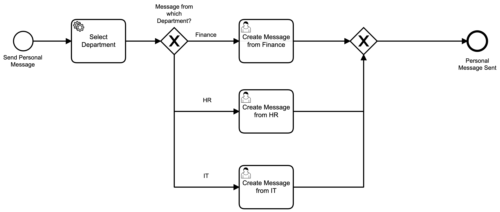
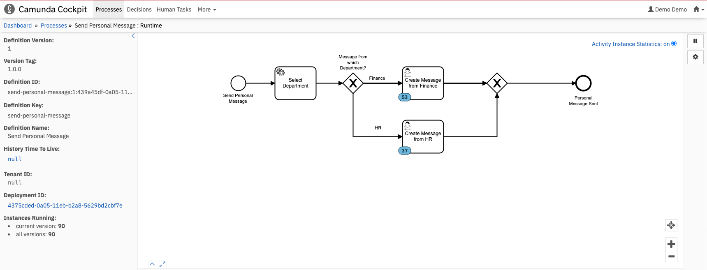
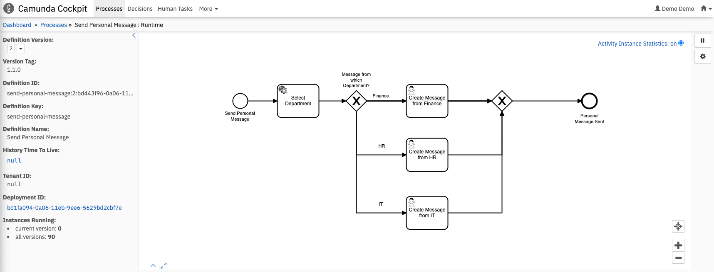
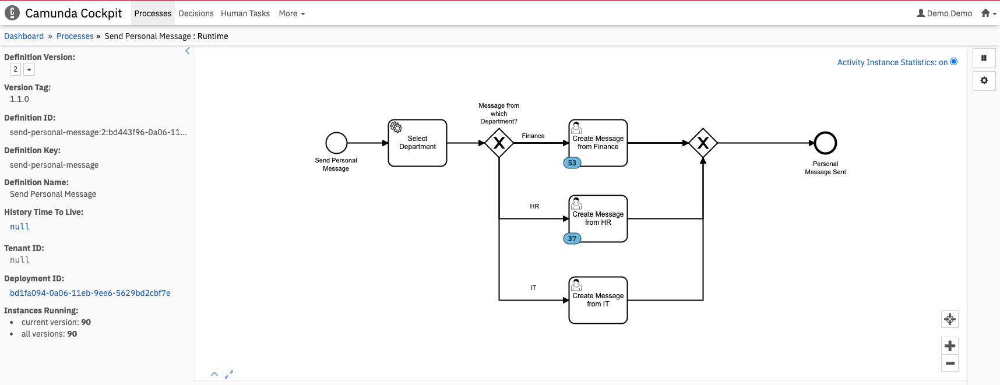

# Example 1: Migration example with activity match
The following example describes a scenario where a one-to-one mapping of the activities within the source process definition to the activities within the target process definition exist. In other words, defining a one-to-one relation instruction means that an instance of the source activity is migrated into an instance of the target activity. 

## Getting Started
The following list defines the technologies and libraries I used to implement the sample code:
* Maven 3.6+
* DBeaver SQL Software 
* Java 11
* Camunda Modeler
* An IDE of your choice:
  * Spring Tool Suite, Eclipse, IntelliJ IDEA Community Edition

## Prerequisites
* Access to Backbase Repository (https://repo.backbase.com)
* Create a local developer environment. See [Backbase Community](https://community.backbase.com/documentation/flow/latest/create_developer_environment)

## Process Definitions
### Send Personal Message V1.0.0
The following diagram contains the BPMN for the Send Personal Message V1.0.0 process definition.


### Send Personal Message V1.1.0
The following diagram contains the BPMN for the Send Personal Message V1.1.0 process definition.


## Application Configuration
The application configuration is the single most important information that is used to instruct the Migration Application on how to migrate the process instances. The application configuration consists mainly of database configuration and also the migration configuration itself.

### Database Configuration
The migration application must connect to the same database as the flow application. The configuration within the application.yaml file is defined as follows:

```yaml
spring:
  datasource:
    url: jdbc:mysql://localhost:3306/send-personal-message-flow
    username: root
    password: root
```

### Migration Configuration
The migration configuration specifies the properties used by the migration application to perform the process instance migration. The configuration within the application.yaml file is defined as follows:

```yaml
migration:
  sourceDefinition:
      key: "send-personal-message"
      version: "1.0.0"
  targetDefinition:
      key: "send-personal-message"
      version: "1.1.0"
  updateEventTriggers: false
  skipIoMappings: false
  skipCustomListeners: false
```

The meaning of the properties are as follows:
* The `migration:sourceDefinition:key property` defined the process key of the source process definition. This value is set within the `Id` field on the General tab within the Camunda Modeller application of the process definition.
* The `migration:sourceDefinition:version` property defined the version tag of the source process definition. This value is set within the `Version Tag` field on the General tab within the Camunda Modeller application of the process definition.
* The `migration:targetDefinition:key` property defined the process key of the target process definition. This value is set within the `Id` field on the General tab within the Camunda Modeller application of the process definition.
* The `migration:targetDefinition:version` property defined the version tag of the target process definition. This value is set within the `Version Tag` field on the General tab within the Camunda Modeller application of the process definition.
* The `migration:updateEventTriggers` property toggles whether the migration instructions should include updating of the respective event triggers where appropriate. 
* The `skipIoMappings` property specifies whether custom listeners (task and execution) should be invoked when executing the instructions.
* The `skipCustomListeners` property specifies whether input/output mappings for tasks should be invoked throughout the transaction when executing the instructions.

## Running the Example

### 1. Create a local developer environment
The Flow Applications and the Migration Application requires the Backbase local environment to run. A detailed explanation 
on how to setup the local environment can be found on [Backbase Community](https://community.backbase.com/documentation/flow/latest/create_developer_environment).    

As a minimum start the following:
* MySQL Database
* The Infrastructure and Platform Services
* The Edge service

### 2. Create the database
You can use DBeaver (SQL Software) to connect to the MySQL database to create a database called `send-personal-message-flow`.

### 3. Start the Flow Application V1

In a new terminal window, go to `example1-migration-with-activity-match/flow-application-v1` and execute the following command:
```bash
$ mvn spring-boot:run -Dspring-boot.run.profiles=mysql
```

The Flow Application will startup and deploy the `send-personal-message` process definition with version 1.0.0 to the Camunda BPM engine.

Validate that the Flow Application is up and running by opening the IPS Eureka registry in your browser using: http://localhost:8080/registry/

In a new terminal window, go to `example1-migration-with-activity-match/` and execute the following command:

```bash
$ bash run_interaction.sh
```

The script executes a curl command that starts the interaction engine, which in turn starts an instance of the `send-personal-message` process.

### 4. Start the Migration Application

In a new terminal window, go to `example1-migration-with-activity-match/migration-application` and execute the following command:
```bash 
$ mvn spring-boot:run
```

Open the Camunda Cockpit application in your browser using: 

In your browser, navigate to http://localhost:9091 and log in to Camunda Cockpit using the admin credentials:

* Username: demo
* Password: demo

Navigate to the Cockpit web application, select the processes and finally view the "Send Personal Message" process definition. You should be able to see the following screen:

 


### 5. Stop Flow Application V1 & Start Flow Application V2

**Note:** Remember to first stop the Flow Application V1 service.

In a new terminal window, go to `example1-migration-with-activity-match/flow-application-v2` and execute the following command:
```bash
$ mvn spring-boot:run -Dspring-boot.run.profiles=mysql
```

The Flow Application will startup and deploy the `send-personal-message` process definition with version 1.1.0 to the Camunda BPM engine.

Validate that the Flow Application is up and running by opening the IPS Eureka registry in your browser using: http://localhost:8080/registry/

### 6. View New Process Definition

In your browser, navigate to http://localhost:9091 and log in to Camunda Cockpit using the admin credentials:
* Username: demo
* Password: demo

Navigate to the Cockpit web application, select the processes and finally view the "Send Personal Message" process definition. 

**Note:** The Definition Version has changed to a drop-down and the second version is available. You should be able to see the following screen:

 


### 7. Perform the Migration

In a new terminal window, go to `example1-migration-with-activity-match/` and execute the following command:

```bash
$ bash run_migration.sh
```

The script executes a curl command that starts the execution of the Migration Plan. 

### 8. View Migration Result
In your browser, navigate to http://localhost:9091 and log in to Camunda Cockpit using the admin credentials:
* Username: demo
* Password: demo

Navigate to the Cockpit web application, select the processes and finally view the "Send Personal Message" process definition. 

**Note:** Ensure that version 2 is selected and that the page was refreshed. You should be able to see the following screen:



